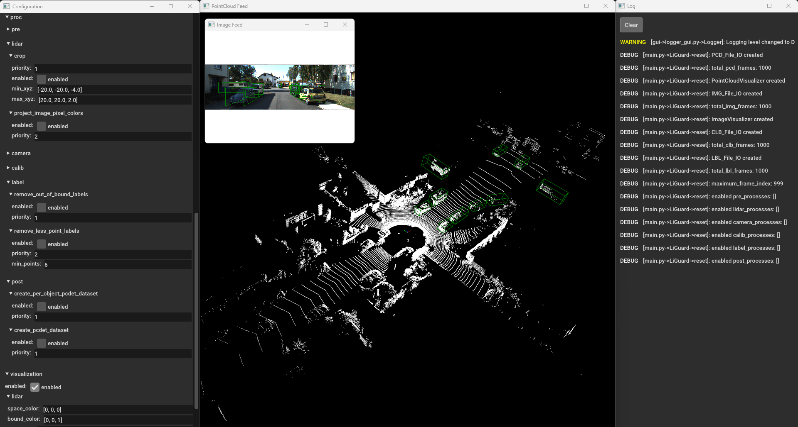
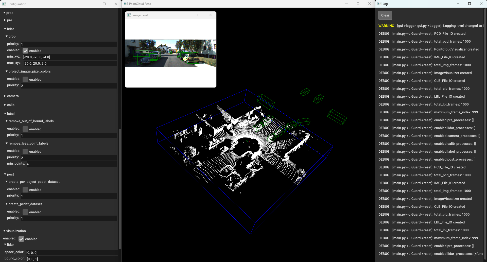
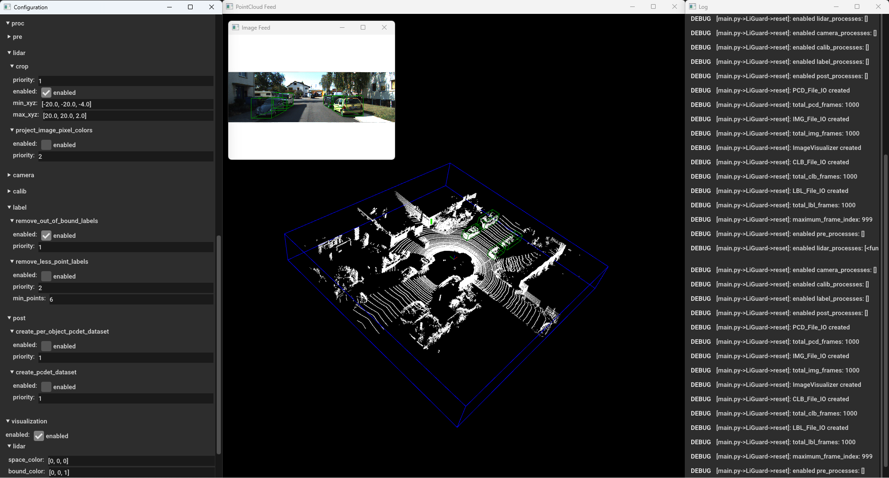

# LiGuard
`LiGuard` is a research-purposed, GUI-powered, Python-based framework that allows easy development of dynamic point-cloud (and accompanying image) data processing pipelines by decoupling processes algorithms from framework's source code. Please see [Usage](#usage) section below for more information.

# Installation
`LiGuard` is tested on Windows 11 with Python 3.10.0. However, it should work on any OS that support following dependencies:
```
keyboard==0.13.5
pyyaml==6.0.1
open3d==0.18.0
opencv-python==4.9.0.80
dbscan==0.0.12
```

We recommend using a virtual environment (like Conda) to install the `LiGuard`.

First create a new virtual environment and activate it:
```
conda create -n liguard python=3.10
conda activate liguard
```

Then, clone the repository:
```
git clone https://github.com/m-shahbaz-kharal/LiGuard-JOSS.git
cd LiGuard-JOSS
```

Lastly, install the dependencies:
```
pip install -r requirements.txt
```

# Usage
`LiGuard` is designed to help researchers build dynamic point-cloud processing pipelines. It act as an execution engine for I/O, processing, and visualization of both point-cloud and image data. A high-level architecture diagram is given [here](docs/extra/architecture.md). Let's see how to use `LiGuard` with a simple yet intuitive example.

## An Example Pipeline
In this example, we will implement a simple pipeline to read (a subset of) KITTI dataset, crop the point-clouds, remove any labels that are out of the crop-bound, also remove labels that have less than 1000 points, and save the processed dataset in OpenPCDet annotation standard. Let's break down the pipeline into steps:
```
# Pipeline
1. Read: Read KITTI dataset.
2. Process:
- Crop: Crop the point-clouds.
- Filter Operation 1: Remove out-of-bound labels.
- Filter Operation 2: Remove labels with less than 1000 points (in the 3d bounding-box).
3. Post-Process:
- Save: Cropped point-clouds in npy format.
- Save: Labels in OpenPCDet annotation standard.
```
## Implementing the Pipeline in LiGuard
In `LiGuard`, a pipeline is implemented by creating a configuration YAML (.yml) file. A default template pipeline configuration (.yml) file `config_template.yml` is provided in the `configs` directory. Please do not delete or modify this file. Instead, duplicate it and rename to your pipeline name; for this example, let's name it `my_kitti_config.yml`.

### Understanding the Pipeline Config File
This is how it looks:
```
# This is a LiGuard pipeline configuration file.

data: # dataset configurations
    path: 'data' # root directory containing dataset
    lidar_subdir: 'lidar' # subdirectory containing point clouds
    camera_subdir: 'camera' # subdirectory containing images
    label_subdir: 'label' # subdirectory containing labels
    calib_subdir: 'calib' # subdirectory containing calibration files
    size: 10 # number of frames to annotate

    lidar:
        enabled: True # set True to read point clouds from disk
        pcd_type: '.bin' # can be .bin or .npy
    camera:
        enabled: False # set True to read images from disk
        img_type: '.png' # most image types are supported
    calib:
        enabled: True # set True to read calibration files from disk
        clb_type: 'kitti' # can be kitti or sustechpoints
    label:
        enabled: False # set True to read labels from disk
        lbl_type: 'kitti' # can be kitti, openpcdet, or sustechpoints

sensors: # lidar and camera configurations
    lidar: # lidar sensor configurations, at this point only Ouster lidars are supported, support for other lidars is coming soon
        enabled: False # set True to stream point clouds from sensor, please set False if reading from disk
        hostname: '192.168.1.2' # sensor ip address or hostname
        manufacturer: 'Ouster' # sensor manufacturer
        model: 'OS1-64' # sensor model
        serial_number: '000000000000' # sensor serial number
    camera: # camera sensor configurations, at this point only Flir cameras are supported, support for other cameras is coming soon
        enabled: False # set True to stream point clouds from sensor, please set False if reading from disk
        hostname: '192.168.1.3' # sensor ip address or hostname
        manufacturer: 'Flir' # sensor manufacturer
        model: 'BFS-PGE-16S2C-CS' # sensor model
        serial_number: '00000000' # sensor serial number
        camera_matrix: [2552.449042506032, 0.0, 766.5504021841039, 0.0, 2554.320087252825, 553.0299764355634, 0.0, 0.0, 1.0] # camera matrix (K)
        distortion_coeffs: [-0.368698, 0.042837, -0.002189, -0.000758, 0.000000] # distortion coefficients (D)
        T_lidar_camera: [[-0.00315, 0.00319, 0.99999, -0.17392], [-0.99985, -0.01715, -0.00309, 0.00474], [0.01714, -0.99985, 0.00324, -0.05174], [0.00000, 0.00000, 0.00000, 1.00000]] # 4x4 transformation matrix from camera to lidar

proc: # liguard processing configurations
    pre:
        dummy: # dummy pre-process
            enabled: False # set True to enable
            priority: 1 # priority of process - lower is higher
    lidar:
        crop:
            priority: 1 # priority of process - lower is higher
            enabled: False # set True to crop point cloud
            min_xyz: [-40.0, -40.0, -4.0] # minimum x, y, z
            max_xyz: [+40.0, +40.0, +2.0] # maximum x, y, z
        project_image_pixel_colors:
            enabled: False # set True to paint point cloud with rgb
            priority: 2 # priority of process - lower is higher
    camera:
        project_point_cloud_points: # project point cloud points to camera image
            enabled: False # set True to project point cloud points to camera image
            priority: 1 # priority of process - lower is higher
    calib:
        dummy: # dummy calibration process
            enabled: False # set True to enable
            priority: 1 # priority of process - lower is higher
    label:
        remove_out_of_bound_labels: # crop out of bound bboxes
            enabled: False # set True to crop labels
            priority: 1 # priority of process - lower is higher
    post:
        create_per_object_pcdet_dataset: # create per object dataset in pcdet format
            enabled: False # set True to enable
            priority: 1 # priority of process - lower is higher
        create_pcdet_dataset: # create dataset in pcdet format
            enabled: False # set True to enable
            priority: 1 # priority of process - lower is higher

visualization: # visualization parameters
    enabled: True # set True to visualize
    lidar:
        space_color: [0, 0, 0] # color of background space
        bound_color: [0, 0, 1] # point cloud range bound bbox color
        point_size: 2.0 # rendered point size
    camera:
        bbox_line_width: 2 # bbox line width

logging: # parameters for logger
    level: 0 # log level can be 0 (DEBUG), 1 (INFO), 2 (WARNING), 3 (ERROR), 4 (CRITICAL
    path: 'logs' # path to save logs
        
threads: # don't change unless debugging
    io_sleep: 0.01 # input/output threads sleep time in seconds
    proc_sleep: 0.01 # processing threads sleep time in seconds
    vis_sleep: 0.01 # visualization threads sleep time in seconds
```

You can see that the pipeline config file is divided into six main sections. It is important to understand the structure of the pipeline config file to build the pipeline. Here is a brief overview of each section:
```
data: to configure dataset paths and types.
sensors: to configure sensor connection paramters in case of streaming data.
proc: to configure processing steps, it has:
- pre: for configuring pre-processing tasks
- lidar: for configuring point-cloud processing
- camera: for configuring image processing
- calib: for configuring calibration data processing
- label: for configuring label/annotation processing
- and post sections: for configuring post-processing tasks
visualization: for setting visualization parameters.
logging: for setting logging level and path.
threads: responsible for changing threading paramters. # don't change unless debugging
```
Please note that you must not delete the main sections (all the section names given above are main sections); so if you were to assign levels based on indenting, upto level 2 sections must be kept same (unless you are contributing to the repo and think to add a feature to framework itself). However, you can add new sections (at level 3 or more), so for example, you can add a new section under `proc/lidar/` but not under `proc`.

### Implementing the Pipeline Steps
Let's now modify `my_kitti_config.yml` to implement the pipeline we devised above. `LiGuard` has many built-in utility processes/functions; a list of those is provided in [Utility Functions](docs/extra/utility_functions.md) that can be used to build the pipeline. We'll be using some of these utility functions in our example.

Pipeline Step # 1: `LiGuard` provides built-in capability to read many standard datasets including KITTI, OpenPCDet, and SUSTechPoints (support for more public datasets is coming soon). Nothing needs to be done for this step, as it is already configured in the template pipeline config file.

Pipeline Step # 2:
- Crop: a built-in utility process `crop` under `algo/lidar.py` can be used to crop the point-clouds.
- Filter Operation 1: a utility process `remove_out_of_bound_labels` under `algo/label.py` can be used.

### Adding a New Process in the Pipeline
However, as you can see in the pipeline config file, there is no built-in utility processes for Filter Operation 2 in our pipeline. This provides an opportunity to demonstrate how to add a novel process in the pipeline. Please follow the steps below to add a new process in the pipeline:
- add following lines under `proc/label/` section in `my_kitti_config.yml`:
```
remove_less_point_labels: # remove labels with less than min_points points
    enabled: False # set True to remove labels
    priority: 2 # priority of process - lower is higher
    min_points: 1000 # minimum number of point-cloud points that must be inside the 3d bounding-box label to be consider a label valid otherwise it will be removed
```
Every process function in the pipeline config file must follow the following standard format:
```
# config.yml
...
proc:
    category: # category can be pre, lidar, camera, calib, label, or post
        process_name: # must be at level 3
            enabled: boolean
            priority: integer
            # add more parameters as per your requirement
...
```
It must have the following parameters:  
- `enabled`: a boolean to enable/disable the process. 
- `priority`: an integer to set the priority of the process in the category, for example, in the `label` category, the `remove_out_of_bound_labels` process has a priority of 1, so we set the `remove_less_point_labels` priority to 2; this means that the `remove_out_of_bound_labels` process will be executed before the `remove_less_point_labels` process. 

You can also add more parameters as per your requirement. For example in this case, we added `min_points` (to make this a tunable paramter in the GUI later) to set the minimum number of points that must be inside the 3d bounding-box label to be consider a label valid otherwise it will be removed.
- add the following function in `algo/label.py`:
```
def remove_less_point_labels(data_dict: dict, cfg_dict: dict):
    # Get logger object from data_dict
    if 'logger' in data_dict: logger:Logger = data_dict['logger']
    else: print('[CRITICAL ERROR]: No logger object in data_dict. It is abnormal behavior as logger object is created by default. Please check if some script is removing the logger key in data_dict.'); return

    # Check if required data is present in data_dict
    if "current_label_list" not in data_dict:
        logger.log('[algo->label.py->remove_less_point_labels]: current_label_list not found in data_dict', Logger.ERROR)
        return
    if 'current_point_cloud_numpy' not in data_dict:
        logger.log('[algo->label.py->remove_less_point_labels]: current_point_cloud_numpy not found in data_dict', Logger.ERROR)
        return

    # Get label list and point cloud
    lbl_list = data_dict['current_label_list']
    point_cloud = data_dict['current_point_cloud_numpy']
    
    output = []

    for lbl_dict in lbl_list:
        if 'lidar_bbox' not in lbl_dict: continue
        # Get bounding box center, extent, and euler angles
        bbox_center = lbl_dict['lidar_bbox']['lidar_xyz_center']
        bbox_extent = lbl_dict['lidar_bbox']['lidar_xyz_extent']
        bbox_euler_angles = lbl_dict['lidar_bbox']['lidar_xyz_euler_angles']
        R = o3d.geometry.OrientedBoundingBox.get_rotation_matrix_from_xyz(bbox_euler_angles)
        # Create an oriented bounding box
        try: rotated_bbox = o3d.geometry.OrientedBoundingBox(bbox_center, R, bbox_extent)
        except:
            logger.log(f'[algo->label.py->remove_less_point_labels]: failed to create an OrientedBoundingBox, skipping ...', Logger.WARNING)
            continue
        # Get the indices of points within the bounding box
        inside_points = rotated_bbox.get_point_indices_within_bounding_box(o3d.utility.Vector3dVector(point_cloud[:, 0:3]))
        # If the number of points within the bounding box is greater than the specified threshold, add the label to the output list
        if len(inside_points) >= cfg_dict['proc']['label']['remove_less_point_labels']['min_points']: output.append(lbl_dict)

    # Update the label list in data_dict
    data_dict['current_label_list'] = output
```
Remember that function name must match the name given in the pipeline config file otherwise it will not be executed.

Let's take a look into the function. The function `remove_less_point_labels` takes two arguments: `data_dict` and `cfg_dict` that are automatically passed to it by framework as it called (if `enabled`) in order of its `priority`. This is a standard that `LiGuard` follows, so to create any process for your pipeline your function must have the following signature:
```
# it must be written in algo/<category>.py file where <category> can be pre, lidar, camera, calib, label, or post
your_function_name(data_dict: dict, cfg_dict: dict)):
    ... # your function logic
```

#### Understanding Parameter Passing in LiGuard
Let's talk a little bit more about the `data_dict` and `cfg_dict` as these are automatically passed (by reference) to all processes in the pipeline. The `data_dict` is a dictionary that, as the name suggests, contains the data that is shared between different processes in the pipeline. The `data_dict` contains the following keys:
- `logger`: a logger object that can be used to log messages.
- `current_frame_index`: an integer representing the current frame index.
- `maxium_frame_index`: an integer representing the maximum frame index.
and may contain follwoing keys depending on the pipeline.
- `current_point_cloud_numpy`: a numpy array containing the current point cloud.
- `current_image_numpy`: a numpy array containing the current image.
- `current_calib_data`: a dictionary containing the current calibration data in KITTI calibration format, however this may change based on unavailbility of all matrices. It may contain following keys:
    - `P2`: a 3x4 projection matrix.
    - `R0_rect`: a 3x3 rectification matrix.
    - `Tr_velo_to_cam`: a 4x4 transformation matrix from lidar to camera.
- `current_label_list`: a list of dictionaries containing the current labels. Each dictionary item in the list may contain the following keys:
    - `label_class`: a string representing the label class.
    - `lidar_bbox`: a dictionary containing the lidar bounding box. It may contain the following keys:
        - `lidar_xyz_center`: a list containing the x, y, z center of the bounding box.
        - `lidar_xyz_extent`: a list containing the x, y, z extent of the bounding box.
        - `lidar_xyz_euler_angles`: a list containing the x, y, z euler angles of the bounding box.
    - `camera_bbox`: a dictionary containing the camera bounding box. It may contain the following keys:
        - `camera_uv_center`: a list containing the u, v center of the bounding box.
        - `camera_uv_extent`: a list containing the u, v extent of the bounding box.
        - `camera_uv_euler_angles`: a list containing the u, v euler angles of the bounding box.

Please note that the above mentioned keys are standard keys that are used accross the framework. However, you can add more keys to the `data_dict` as per your requirement to be shared between different components of the framework.

The `cfg_dict` mirros your pipeline config file, so you can access any parameter from the pipeline config file using this dictionary. Each level in the pipeline config file translates to a sub-dictionary in `cfg_dict`.

Now let's look into this function's logic:
- The function first checks if the required data is present in the `data_dict`. If not, it logs an error message and returns. It is always a good practice to check if the required data is present in the `data_dict` before using it.
- The function then gets the label list and the point cloud from the `data_dict` and for each label:
 - It creates an oriented bounding box using the label's center, extent, and euler angles, checks if the number of points within the bounding box is greater than the specified threshold, and if so, adds the label to the output list.
- Finally, it changes the `current_label_list` in the `data_dict`, it is important to create/update the data in the `data_dict` so that it can be shared across different processes in the pipeline.

Pipeline Step # 3: `LiGuard` provides built-in capability to save the processed lidar data in npy format and labels in OpenPCDet annotation standard. It is already configured in the pipeline config file, so you don't need to do anything.

### Running the Pipeline
Now let's run the pipeline, run the following command to start the `LiGuard`:
```
python main.py
```
This will start the `LiGuard` and you'll see the following two windows:

Configuration Window            |  Log Window
:-------------------------:|:-------------------------:
  |  

*On the left is the Configuration Window, it lets you open, save, and apply configurations. On the right is the `Log` window, it shows the logs that are generated during the pipeline execution by both the built-in functions and the user-defined functions (if user-defined functions are using the logger object).*

### Opening the Pipeline Config File
Please go ahead and click open, then select the `my_kitti_config.yml` file and click open. This will load the pipeline config file into the `LiGuard`. You can change the configuration parameters, in this example case, enable all the data reading processes `lidar`, `camera`, `calib`, and `label` and disable all the processes under `proc`, click apply to apply the changes. You'll see the data being read from the disk and displayed in the visualization window. 

*LiGuard's Layout: from left to right: Configuration Window, Visualization Window, and Log Window.*
##### Navigation
You can navigate through the frames using the `left arrow` and `right arrow` keys, or press the `space bar` to play the frames in sequence.

### Processing the Data
 Please pause the frames by pressing the space bar again and then enable the '`crop` process under `proc/lidar` and click apply. You'll see the point-clouds being cropped. 

*LiGuard in Action - Cropping Point-Cloud(s)*

Similarly, enable the `remove_out_of_bound_labels` and see the results.

*Liguard in Action - Cropping + Filtering Out Out-of-Bound Annotation*

Moving on, please enable, `remove_less_point_labels` and see the results.

*Liguard in Action - Cropping + Filtering Out Out Out-of-Bound and Annotations With < 1000 Points*

Finally, if the pipeline is working as expected (check it by manually navigating a few frames), you can save the pipeline config file by clicking the `save` button. To process the entire dataset, you can change the `size` parameter under the `data` section in the pipeline config file to the number of frames you want to bulk process, disable the `visualization`, enable the `create_pcdet_dataset` under `proc/post` and click apply. Press the space bar to start the processing. The `Log` window will show the progress of the processing. The processed data is stored under in `output` directory under the root directory of the dataset.

### Verifying the Processed Data
You can verify the processed data by creating a new pipeline config file and loading the processed data. For our example, please duplicate the `config_template.yml`, rename it, and start `LiGuard`. In the `data` section of configuration set the path and sub-paths, make sure you disable `camera` and `calib` reading process under `data` and only enable `lidar` and `label`. This is because the `output` directory created by `create_pcdet_dataset` only contains `point_cloud` and `label` sub-directories. Also, make sure to set `lbl_type` under `data/label` to `openpcdet` and `pcd_type` under `data/lidar` to `.npy`, click apply. You can now visualize the processed data.

# Contributing
We welcome contributions to the `LiGuard` framework. Please follow the guidelines below to contribute to the framework:
- Fork the repository.
- Create a new branch for your feature or bug fix.
- Make your changes.
- Write tests for your changes.
- Run the tests.
- Create a pull request.

# License
MIT License Copyright (c) 2024 Muhammad Shahbaz - see the [LICENSE](LICENSE) file for details.

# References
- [Open3D](http://www.open3d.org/)
- [OpenCV](https://opencv.org/)
- [KITTI](http://www.cvlibs.net/datasets/kitti/)
- [OpenPCDet](https://github.com/open-mmlab/OpenPCDet)
- [SUSTechPoints](https://github.com/naurril/SUSTechPOINTS)